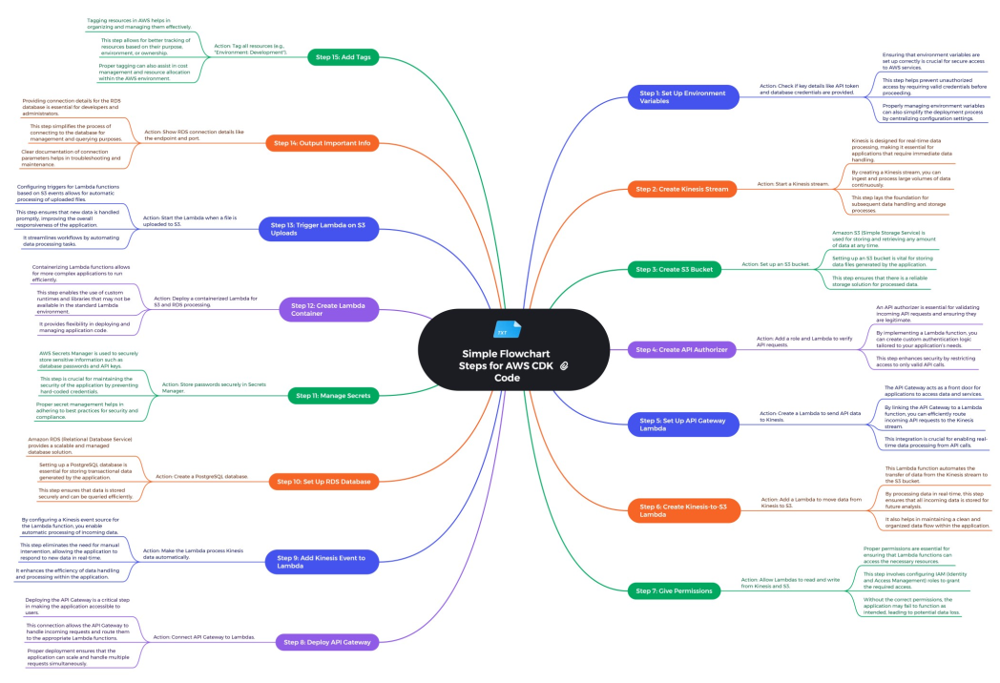
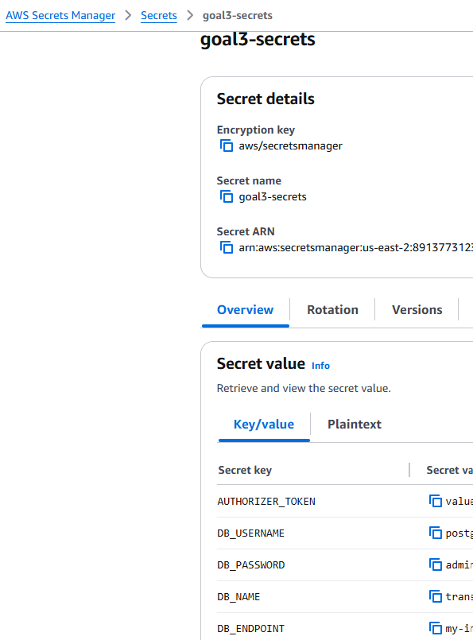

# AWS Realtime Credit Card Transaction Streaming OLTP Data Pipeline  
## Overview
This project explores AWS services to perform near real-time Online Transactional Processing (OLTP) pipeline, which involved streaming of data and process it before stored in S3 bucket

### Key Takeaways:

1. Hands-on experience with AWS Services dedicated for streaming including Kinesis data stream, lambda for event driven service and RDS Postgres as main relational database management system
2. Implementation of relational modeling from conceptual layer to physical layer ER diagram that focused on business interest first
3. End-to-end data engineering streaming solution from data extraction to data storage

## Objectives:
1. Build a scalable OLTP pipeline using AWS cloud services that consist of services that are fully managed and serverless.
2. Design ER diagram for relational modeling that ensure integrity, optimization and segregation of data importance based on entities declared.
3. Gain expertise with cutting-edge tools in cloud computing by building pipeline using AWS service.

## Use Case: Financial Institution
In the dynamic world of financial services, institutions are perpetually tasked with the challenge of combating Anti-Money Laundering (AML) and Counter-Terrorism Financing (CTF). These illicit activities involve a wide range of customer transactions, both digital and physical. To effectively identify and intercept these suspicious transactions, institutions must continuously enhance their turnaround time for monitoring and analysis. Implementing near real-time transaction event monitoring is critical in tracking and responding to potentially malicious activities. By leveraging advanced technologies that support efficeint and near real time data streaming thru AWS service, financial institutions can promptly detect anomalies and take proactive measures using data analytics faster to prevent fraudulent activities, ensuring compliance and safeguarding the financial system.

OLTP streaming is the ideal solution here, offering:

1. Rapid storage for credit card transaction.
2. Organized data storage consistently and efficiently through Entity Relationship (ER) modeling in mind.

## Contents

- [The Dataset](#-the-dataset)
- [Project Architecture](#-project-architecture)
- [Transaction Streaming Processing Pipeline](#-transaction-stream-processing-pipeline)
- [Project Demo Highlights](#project-demo-highlights--walkthrough)
- [Technical Challenges and Solutions](#technical-challenges-and-solutions)
- [Conclusion](#-conclusion)
- [Future Enhancements](#-future-enhancements)
- [Connect With Me](#-connect-with-me)
- [Appendix](#-appendix)

Please refer the credit card data dictionary in [data-dictionary.md](./er-diagram-design/data-dictionary.md)

## Project Architecture
The project leverages several key technologies to create a reliable OLTP streaming system:


The data processing pipeline consists of four main phases:

1. Connect: Scripts extract data from the source, transform it, and send it to target storage for further processing.
2. Processing: Raw data undergoes transformation and cleaning.
3. Storage: Related data records (processed or raw data), container must be stored in a storage database or a repository.
4. Visualization: Tools analyze and display the processed data, enabling data-driven reporting based on organizational needs.

The pipeline overview classified according to Andreas's data science blueprint functionality:


## Transaction Stream Processing Pipeline
The stream pipeline starts by local client create request via RESTful API GET/POST method to the AWS API Gateway, the request will be authenticated by lambda. Lambda will then generate an allow or deny policy which if allow then pass the data into Kinesis data stream which will buffer the data. A landing S3 bucket will then store the data and event driven lambda will automatically pass the data into a custom Postgres database created using RDS. Then, a Quicksight dashboard is created by pulling data inside the Postgres and pgAdmin used for monitor data strcuture/ or query purpose of data inside the Postgres

### Detailed Pipeline Process Flow:

#### Connect
- **API Gateway** acts as the entry point for the data. External clients (e.g., merchant applications) submit credit card transaction data via HTTP POST requests.
- The requests are validated for authentication and data quality using Lambda authorizer and only authorized requests are forwarded to the next stage

#### Processing
Lambda is used as main processing tool in several key areas:

1. **API Gateway Authorization :**
   - Lambda act as an authorizer and validate user token. If token is valid, it will generate an `allow access` policy to dedicated resource for the next stage

2. **Data Extraction and Transfer:**
   - Data POST request if authorized will be processed by a lambda and put into Kinesis Data Stream
   - Data received by **Kinesis Data Stream** is processed by a Lambda function to:
     - Batch incoming records
     - Convert raw transaction logs into a structured CSV or JSON format.
     - Store the processed data into an S3 bucket

3. **Data Cleaning and Aggregation:**
   - A separate lambda function is triggered by S3 events (e.g., new files added to the bucket)
   - The Lambda function performs:
     - Data integrity checks (e.g., handling duplicates or missing fields).
     - Aggregation or mapping of transactions for relational database ingestion
     - Inserts or updates transaction data into an **RDS PostgreSQL** instance

#### Storage
- The **S3 bucket** serves as the primary landing zone for:
    - Raw transaction data streamed from Kinesis
    - Processed CSV/JSON files for ingestion into the RDS database
- A dedicated access log bucket will also be created for audit trail purpose on any access activity in the main bucket

#### Visualization
1. **QuickSight for Dashboarding:**
   - **Amazon QuickSight** is integrated with the RDS database to create interactive dashboards. These dashboards provide insights into key metrics, such as:
     - Total transaction volumes
     - Fraud detection alerts (if implemented in the future)
     - Trends and patterns across credit card usage

2. **pgAdmin for Database Inspection:**
   - **pgAdmin** is used for:
     - Inspecting the RDS PostgreSQL tables to ensure the accuracy and consistency of the stored OLTP data
     - Running ad-hoc SQL queries to troubleshoot issues or extract additional insights
   - This tool is essential for database administrators during the development and debugging phases

## 🪧Project Demo Highlights & Walkthrough

### 0. Relational Data Modeling / Entity Relationship Diagram Design

In this project, I aim to simulate a business scenario that serves as a foundational starting point for any data pipeline initiative. Clear communication with downstream business users is essential; without it, the data pipeline design risks becoming ineffective, leading to a data swamp rather than delivering valuable insights. It is crucial to recognize that technical implementation must align with the organization’s overarching business objectives. This project follows a bottom-up approach, prioritizing the needs of downstream users before addressing upstream processes. An Entity-Relationship (ER) diagram plays a vital role in ensuring that OLTP data storage is reliable, consistent, and free from duplication just enough as business use required. By applying data normalization techniques, the risk of data errors is significantly reduced, as records are systematically updated to maintain accuracy. The choice of a relational database management system (RDBMS) is appropriate here due to its ACID properties, which guarantee atomicity, consistency, isolation, and durability, ensuring the integrity of transactional data throughout the pipeline.

Conceptual model:


Physical model:


For above conceptual and physical data model, I have attached a document that includes proposed potential business questions to start constructing the relational model, the methodology and thought process to design conceptual, logical and physical data model. Refer [schema_design_cc_fraud.xlsx](./er-diagram-design/schema_design_cc_fraud.xlsx).

### 1. Project Setup & Structure

#### a. AWS Cdk Setup
To run cdk project there are few dependencies need to be setup:
    - node.js (backend language), npm package manager and main language typescript
```
# ensure sudo is update to avoid any command issue
sudo apt update
sudo apt upgrade -y

# fetch any latest node.js in website and install using sudo
curl -fsSL https://deb.nodesource.com/setup_18.x | sudo -E bash -
sudo apt install -y nodejs

# install typescript language via package manager
npm install typescript

# install aws cdk package via npm
npm install -g aws-cdk

# later check the installed version
cdk --version
```

Setup project in a specific directory. I am using typescript language for the AWS CDK
```
# initiate prebuilt project
cdk init app --language=typescript

# install main use library for cdk such as construct
npm install aws-cdk-lib constructs

# install related libraries use for constructing resources
npm install @aws-cdk/aws-s3 @aws-cdk/aws-lambda 
```
- Ensure to populate the templated project structure accordingly
- in this project I mainly touch the script on lib/path which should contain the main configuration of the resources. Also, some minor alteration to bin/ .ts script just to make it aware how the main stack in lib/ is named. The other default folder will relatively populated as I performed cdk bootstrap like package.json that will auto populate the important package to install.

### 2. Finalize project structure
It is essential to setup a clear, modular project to ensure readability, concise separation of usage of services and ease maintenance and troubleshoot for data engineering team.

```
cdk-github-action
├── .github/
│   └── workflows/
│       └── deploy.yml
├── bin/
│   └── cdk-github-action.ts
├── lib/
│   ├── aws-handson-stack.ts
│   ├── data/
│   ├── client/
│   ├── lambda-src/
|   |   ├── merge-csv-upsert-rds/
|   |   |   ├── app.py
|   |   |   ├── Dockerfile
|   │   │   └── requirements.txt
│   ├── lambda/
│   │   ├── api_gateway_to_kinesis.py
│   │   ├── kinesis_to_s3.py
│   │   ├── lambda_authorizer.py
│   ├── policies/
│   │   ├── authorizer-policy.json
│   │   ├── rds-policy.json
│   │   ├── read-from-kinesis.json
│   │   ├── write-read-s3.json
│   │   └── write-to-kinesis.json
│   └── constructs/
│       ├── api-gateway.ts
│       ├── kinesis-stream.ts
│       ├── lambda-container.ts
│       ├── lambda-function.ts
│       ├── rds-Postgres.ts
│       ├── roles.ts
│       ├── s3-bucket.ts
│       └── secrets-manager.ts
├── images/
├── er-diagram-design
|   └── schema_design_cc_fraud.xlsx
├── test/
├── .gitignore
├── .npmignore
├── cdk.json
├── jest.config.js
├── package-lock.json
├── package.json
├── README.md
└── tsconfig.json
```

### 3. Setup of Identity and Access Management (IAM) user, policy and credentials

### a. Setup AWS IAM
 I created a user inside a user group.
 - user group enable sharing of policy for compilation of user under it
 - I.e. create and administrator user group, attach administrator related policy and create bunch of users that will inherit the user group permission access

From IAM GUI below, there is only one user for this project that inherited the policy from user group later:


### b. Setup credential policy and credential

Below are the assigned policies to the user created that will managed the cdk setup. Note that this granted policies "near and full access" might not be suitable to use in production as it opens to wide unnecessary permission:


AWS CDK requires credential of user are `AWS_ACCESS_KEY`,`AWS_SECRET_ACCESS_KEY`,`AWS_REGION` (for this project, the region is in Ohio, us-east-2) and policy such as IAM and CloudFormation access to create resources with respective role.

For creating lambda with containerized package, user need to have access to ECR and respective lambda should able to access the VPC and also equip with RDS policy that is needed to enable management of RDS instance created later on.

This project leverage Github Actions as the main CI/CD tool. Thus, initial credentials required will be stored as Github Action secrets here. This credentials are basic requirement to execute AWS CDK deployment in the cloud.


From Workflow snippet above, noticed that it requires credential to execute AWS CDK project.

In later stage of constructor creation in project main stack file, an AWS secret manager will be created to stored current resource properties (such as bucket name, endpoint of RDS Postgres) in it. This will enable future improvement or project to reuse the resource properties for enhancement or other function and make the project loosely decoupled.

## c. Setup of github workflow

Below is the simplified Github Actions workflow design for this project


Please refer [github action with important notes diagram](./images/goal3_mapify_cdk_deploy_workflow.png "Github Actions workflow overview diagram") for more granular detail of the workflow.

Few consideration I explored here:
- ensure every resource creation is in order of dependency. I.e. lambda with containerized dependency package require login and create a specific repository in Elastic Container Registry (ECR) beforehand. That way then only the dockerized image can be host in the ECR.
- the workflow is setup to trigger as I commit code via `dev` branch or pull request on `main` branch. Thus, it is important to make cdk bootstrap as optional to reduce the time taken and redundancy to setup cdk default resources.
- to ensure container image exist in ECR repo, I use `aws ecr describe` command to list out existing repositories and images
- if the deployment action fail or suceess, there will be log and notification email.

Refer [Github Actions workflow yml](./.github/workflows/deploy.yml) for the workflow configurations detail.

Example workflow trigger by push to dev branch and pull request test success


### 4. Overall key components, main cdk stack and construct creation process

#### a. Overall architecture diagram
Below is the architecture diagram with highlighted important steps on overall pipeline 


#### b. Payload

This project's data payload generally undergoes transformation where:


Initial data structure at client in csv format:


Data transformation at client side from csv to json and response of data transmitted from API Gateway:


Notice the response data from AWS API Gateway is being stringified or encoded twice, causing the quotes (") to be escaped into \".If `json.dumps()` is used, the body field is treated as a stringified JSON

Saved data from Kinesis Data Stream To S3 bucket `oltp-stream-bucket`:


#### c. Authentication consideration
There are some of the available authentication options for this project
- Lambda authorizer
    - Selected for its flexibility to implement custom authentication mechanisms like JWT, hardcoded tokens, or dynamic validation via services like AWS Secrets Manager or a credentials database
    - Summary of authentication process as follows:
        ```
        1. Client sends request with custom token in API header
        2. API Gateway intercepts request and invokes Lambda authorizer
        3. Lambda authorizer will validate token (e.g., query stored credentials, check similarity of token hardcodes value)
        4. If validated, lambda generates IAM policy that allow/denies request
        5. If allowed, forwards to backend Lambda to processes request
        ```
- Amazon Cognito User Pools
    - For initial setup, must create a Cognito User Pool and configure it with the desired settings (e.g., sign-up, MFA). then enable Cognito User Pool Authorizer in API Gateway and link it to the user pool (so that later access token can directly be validate with the user pool)
    - Summary of authentication process as follows:
        ```
        Cognito User Pools Authentication Process Flow:

        1. User Registration/Login using the Cognito User Pool interface and provides their credentials (e.g., username and password)
        2. Token Generation after successful authentication, Cognito issues ID, access, and refresh tokens to the user. These tokens contain information about the user's identity and access permissions
        3. User make request with API authorization header include with token obtained
        4. API Gateway validate the Authorization header by sending access token to Cognito to verify the access token which validate existence of user in user pool using Cognito User Pool Authorizer
        5. Cognito verifies the token and extracts the user's claims and permissions. Cognito decide whether to allow or deny request and generates an IAM policy that reflects the authorization decision
        ```
- API keys
    - Ensure to create static API keys beforehand and associate with API Gateway 
    - Summary of authentication process as follows:
        ```
        1. API Key is created by owner that is static and assigned to dedicated client
        2. Client then make request and include the API key in the x-api-key header of their API request.
        3. API Gateway receives the client's request; it checks the x-api-key header to verify the API key. If the API key is valid, API Gateway allows the request to proceed and forwards the request to the backend Lambda function for processing.
        ```

#### d. Design consideration
- Lambda throttling limit
    - There should be consideration on throttling limit when invoking multiple lambda function. By default, in each region account, lambda invocation concurrency is limited to 1000 at a time
    - I have inspected CloudWatch logs for every lambda, to find the potential lambda with throttle limit. Below is an excerpt of log that provide time taken for lambda invocation (from invoke to finished) estimation and usually the same format across all lambda

        ```
        REPORT RequestId: f4a085ba-b9f3-4ef2-b103-dd10db58947f Duration: 228.50 ms Billed Duration: 229 ms Memory Size: 128 MB Max Memory Used: 77 MB

        where:
        - 228.50 ms = The total time, in milliseconds, that Lambda function code took to execute.
        - 229 ms = The duration rounded up to the nearest 1 ms or 100 ms (depending on the Lambda execution model) for billing purposes. AWS charges for the billed duration
        - 128 MB = The amount of memory configured for this Lambda function (can be upto 10gb)
        - 77 MB = The maximum amount of memory used by Lambda function during this invocation
        ```
    - I learnt that lambda at initial start point, will have `init duration`, which is the time taken for lambda cold start
    - The total time to invoke and finish lambda helps to determine whether my lambda will accidentally reach throttle limit. If a lambda could complete task within few 200 ms at a time, it means in a second, I can invoke the `same` lambda 5 times. It also important to note that lambda can only run at 15 minutes long only at a time. So, I must be aware how fast does payload throughput going through at each lambda encountered plus that cold start also causes some delay in overall lambda's time process at the first initial start or after lambda not used for certain time.

        `ApiAuthorizerLambda` log record:

        

        `ApiGatewayToKinesisLambda` log record:

        

        `KinesisToS3Lambda` log record:

        

        `S3RdsLambdaHandler` log record:

        

    - To validate that a single `same` lambda can be use multiple time if finished job quickly, I can validate using logstream in CloudWatch. If there is multiple start job in single logstream, it means the `same` lambda is invoked multiple time (which shows a good sign as there is no need to invoke concurrent lambda to support job at a time and avoids the overhead of a cold star for new lambda invocation). Below excerpt shows lambda invokes multiple times within the same log streams

    
        

    - The most prominent throttling limit as per screenshot above is at `S3RdsLambdaHandler` where it consumes ~0.6 second per lambda activity. By default, each PutObject event will trigger a separate Lambda invocation. If S3 bucket receives 1,000+ uploads, lambda will invoke 1,000+ times causing the limit error. Also RDS instance itself will hvae issue as it might not able to handle such multiple connections at a time
    - Few workarounds are:
        - Incoming data design throughput
            - for incoming record into API Gateway, it is better to set (probably a merchant machine) to transfer data with aggregated data at a time to avoid exhausting invocation of `ApiGatewayToKinesisLambda`     
        - Use buffer mechanism
            - Once file arrive at S3, S3 will send notification to Simple Queue Service (SQS) or Eventbridge. Then only invoke lambda to process SQS/Eventbridge event in batches. The lambda also can be setup to use certain batch size to `copy / insert into` RDS afterwards
            - Also, I can increase buffer from initial point of contact of data throughput such as increasing number of shards for Kinesis (scale horizontally, typically 1MB/sec or 1000 records/sec per shard) and increase threshold size or time to accumulate more records per file in `KinesisToS3Lambda`. I can even use alternative service like Kinesis Data Firehose to completely replace `KinesisToS3Lambda` for the same task thus providing more reserve of lambda concurrency
            - Then use Dead Letter Queues (DLQ) integrate with lambda for unprocessed events afterwards
        - Lambda reserved concurrency
            - use reserved concurrency on area with high throughput (in this case is `S3RdsLambdaHandler`). By default, the 1000 invocation limit is shared across lambda instances in the project. By reserving 80% of the invocation concurrency might help to mitigate throttling limit
        - Request to temporary upgrade limit to AWS support team (But also incur more cost)

#### e. Main stack setup details
Below is the simplified overview of main stack file input. It consists of resources declarations, assignment of event driven resource, specifying input credentials and resource tagging. It also included creating output in Cloud Formation (cfn) stack's output GUI for debugging purpose.



Example of cfn output of resource parameters for debug purpose:


#### Brief description and Highlighted notes in the main stack script
The [main_stack.ts](./lib/aws-handson-stack.ts) script is mainly used to setup AWS resources required to perform this project such as S3 bucket, lambda, API Gateway etc. It also configures creation of resource using `construct` which basically means the configuration of parameters (either credential, hardware capability, networking or resource dependency) needed for a resource to be deployed.

##### Highlighted notes
- The script validates the credentials which are mandatory to use such as authorization token is available for API Gateway authorization.

- Noticed that some constructor is reusable over few places in the main script. This is because the constructor is written as form of class in its own constructor script such as `lib/constructors/s3-bucket.ts`.

- Generally, each construct will be assigned 
    - a physical ID (ensuring all created policy and role related to it is unique and trackable in Cloud Formation synthesize)
    - a custom name
    - a destroy policy (to auto remove the resource when stack is delete by creating a dedicated default lambda to perform the action)
    - a Key Management Service (kms) key if applicable to encrypt data (at rest or data transit depends on nature of service. If for s3 bucket, data has no movement so it is encrypted at rest). In this project the encryption is using client side managed, which means the credential encryption and decryption detail is managed by AWS
    - a logGroup -> to monitor resource via CloudWatch
    - a tagging -> ensuring all constructs are trackable and easy to manage bill (if complex project require isolation of billing to specific region or specific pipeline phase)

        Below is example on tagging "development" benefit ease to find resource involved
        
         

- `Kinesis stream construct` in [kinesis-stream.ts](./lib/constructs/kinesis-stream.ts):
    - `shard = 1` -> Each shard can be read at up to 2 MB per second and support up to 5 read transactions per second. It also has write capacity of up to 1 MB per second or 1,000 records per second. By specify 1 shard, the setting is only as previously stated. Multiple shards is as if all capability equals to `multiply of shard number`.
    
        ```
        # code snippet kinesis stream assign shard
        this.stream = new kinesis.Stream(this, 'KinesisStream', {
        streamName: 'OLTPStream',
        shardCount: 1, // Adjust shard count as needed
        encryption: kinesis.StreamEncryption.KMS,  // Enable KMS encryption
        encryptionKey: kmsKey,  // Specify the KMS key to use
        });
        ```

        Example created kinesis stream:
        

- `S3 bucket construct` in [s3-bucket.ts](./lib/constructs/s3-bucket.ts):
    - a logging bucket is created together to store server access logs. It also has destroy policy attached. The logging bucket will be assigned to the main s3 bucket to track it record.

        Example of created s3 bucket for landing raw file from kinesis:
        
        

- For `role construct` in [roles.ts](./lib/constructs/roles.ts) generally:
    - assigned custom policy

        example custom policies in GUI assigned to respective role:
        
        

    - each role will have custom name
    - By specifying role type, role can be assigned according to relevant principal -> principal is the related resource that will use this created role through role assumption. When role is assumed, the role will have temporary credential and permissions as in attached policy
    - Also, by specifying role type, the role will have a specific max session duration -> maximum duration role is authorized to make action before next reconfigure credential happen. for example, lambda role will have 1 hour max session duration.

        ```
        # Example code that assign to related principal
        private getRolePrincipals(roleType: RoleType): iam.IPrincipal {
            switch (roleType) {
            case 'lambda':
                return new iam.ServicePrincipal('lambda.amazonaws.com');
            case 'rds':
                return new iam.ServicePrincipal('rds.amazonaws.com');
            case 'composite':
                return new iam.CompositePrincipal(
                new iam.ServicePrincipal('lambda.amazonaws.com'),
                new iam.ServicePrincipal('rds.amazonaws.com')
                );
            case 'authorizer':
                return new iam.ServicePrincipal('lambda.amazonaws.com');
            default:
                throw new Error(`Unsupported role type: ${roleType}`);
            } }
        ```

        example created role by custom declaration or by default(due to certain policy like destroy policy to perform destroy action):
        
        

- `Authorize Lambda construct` in [lambda-function.ts](./lib/constructs/lambda-function.ts):
    - assign custom lambda name
    - assign authorization token in its environment
    - assign a handler/python file [lambda_authorizer.py](../../lambda/lambda_authorizer.py)
        - the lambda will check existence of authorization token and generate a custom policy to invoke the API (enabling POST and GET method able to use)
        - if the token is not found, lambda will generate a deny policy and revert back as rest API response
    - assign a role with name 'Authorizer'
    - lambda will run on AWS managed container on RUNTIME Python 3.9
    - environment encrypt with kms key
    - has log retention in CloudWatch for 1 day

        Example of successful authorized in CloudWatch log:

        

- `apiGatewayLambda construct`:
    - assigned a handler [api_gateway_to_kinesis.py](../../lambda/api_gateway_to_kinesis.py)
        - lambda function here will perform specific action related to request method in REST API format. if it is a POST method, it will fetch the send data and stored it into a specificed kinesis stream's buffer.
    - passed an environment key for kinesis stream name -> this will be used by lambda function as destination path buffer to store data fetch from api POST method

- `kinesisToS3Lambda construct`:
    - assign a handler [kinesis_to_s3.py](../../lambda/kinesis_to_s3.py)
        - desired file size = 1 MB
        - max time threshold = 2 seconds
        - the lambda will process records from stream, then buffer the records and periodically flush to s3 bucket based on the file size criteria of time limit threshold set
        - the stored file in s3 will have unique csv file name that include timestamp and file size.
        - 4 main python function designed for the task
            - reset() -> initiate or reset buffer state. buffer size and last flush time
            - should_flush() -> check a buffer to flush by either one of the threshold set
            - force_flush() -> force flsuh regardless condition if there are remaining records left
            - add_record() -> add a record to buffer & signal by return true if bucket ready to flush

        Example lambda CloudWatch log triggered by `size` threshold:

        

        Example lambda CloudWatch log triggered by `FINAL` flush threshold:

            

    
    - assigned into environment s3 bucket name -> this bucket name will be use by the lambda function as store destination after fetch file from a kinesis stream

- In main stack, some policy is not created inside respective resource construct.
    - this policy is grant using cdk feature `grant` method that will automatically create a default policy
    
        ```
        # snippet in main stack file for grant method
        // Step 11: Grant Permissions
        kinesisStream.stream.grantWrite(apiGatewayLambda.lambdaFunction);
        kinesisStream.stream.grantRead(kinesisToS3Lambda.lambdaFunction);
        s3Bucket.bucket.grantWrite(kinesisToS3Lambda.lambdaFunction);
        ```

- `ApiGatewayConstruct` in [api-gateway.ts)](./lib/constructs/api-gateway.ts):
    - it specify which lambda function and authorizer function to be used
    - create custom API name
    - networking configuration
        - enable default CorsPreFlight option -> allow request from all origin, methods, and specific header
        - create allow header ("Authorization")
    - create token authorization:
        - specify lambda handler that will use the token
        - specify authorizer type use which is "Simple Token Authorize"
    - cached authorization for 5 minutes -> 5 minutes "Time-To-Live" enabled. When token validate, it cached for 5 minutes, so it reduces constraint on the lambda to validate for every second. After 5 minutes, it needs to revalidated again.
    - create a resource such as 'development' -> it is just like a directory for rest api method
    - add method "POST & GET" to use with the authorizer

        Example created API Gateway Stages(Actual POST & GET method route):

        

        Example created API Gateway POST Stage with Simple Token Authorization:

        

- `KinesisEventSource` added to KinesisToS3 lambda:
    - lambdaeventsource, a module that provide multiple event source for vast AWS resource
    - in this case, the event source is linking the lambda to trigger by new kinesis stream buffer has new record
    - an input of batch size 5 is declare -> lambda will process 5 records from kinesis buffer at a time
    - lambda will use TRIM_HORIZON approach for starting position-> lambda will start reading at the oldest available record in Kinesis stream buffer (do note it depend on buffer retention period)
    - I learned that there are 3 starting position to read a record in kinesis using lambda
        - TRIM_HORIZON - suitable to read all records historically available as per buffer retention period
        - LATEST - only read latest available record as at position
        - AT_TIMESTAMP - specify time as at position or read data after certain period
    - I selected to read historical data approach as it allow me to backfill in case data transfer failed at certain point of time

- `rdsInstance construct` in [rds-Postgres.ts](./lib/constructs/rds-Postgres.ts):
    - it need construct properties such as dbUsername, dbPassword,dbName,and instance identifier 'my-instance-rds-Postgres-id',
    - instance identifier is a name of the created RDS resource
    - Networking details
        - the construct will create a new VPC (a virtual private cloud). VPC function as isolated resource setup that will have own networking setup. By default if not specify DNS solver, creating VPC will create a DNS resolver (helps translates hostnames to IP addresses, enabling internet and internal network communication)
        - 2 availability zone
        - public subnet with CIDR = 24 (10.0.0.0/24).  Having two availability zone will create two public subnet with cidr of 24. Public subnet simply means the resource with the subnet will have access to the internet through internet gateway
        - NAT Gateway = 0 as to use free tier limit
        - custom vpc name
        - created a security group
            - allow outbound rule from specific port to outside network 
            - inbound(via ingress rule) for specific port
                - it allow any IPV4 address to has communication with the specific port and use TCP protocol. port here is 5432 (common connection port for Postgres database)
            - has custom name
            - since NACL (network access control list) not define, by default it is created that will allow outbound/inbound at subnet level
            - this indeed not secured, but as this project I am more focused towards creating successful connection, making it public is at least has some security where the database credential is implemented.
            - created parameter group
                - specify database engine used (version 15)
                - specify database hardware capabilities (with free tier limit considered):
                    - max connection from client at a time = 100
                    - shared buffer = 16 MB -> cached data in database size to improve common query performance
                    - work memory = 4 MB -> in memory allocated to perform query faster
                    - work maintenance memory = 64 MB -> allocate in memory storage to perform maintenance operation type query like alter table
                    - effective cache size = 48 MB -> cloud formation own estimation / forecast consumed data use for cache. This is useful to gauge potential load constraint
                    - shared preload library -> load common library
                    - specify timezone (UTC)
            - created database instance
                - specify database engine version
                - assigned the created VPC
                - select free tier instance type (hardware configuration) -> instance class T3, Instance size micro
                - specify subnet type the RDS instance will be deployed -> public subnet
                - specify the instance identifier in construct props/parameter given
                - free tier 20 gb storage and max allocated storage 20 GB (avoid auto scaling)
                - storage type gp2 (general purpose ssd free tier)
                - set the instance is publicly accessible
                - assigned the created security group
                - assigned database credential as received in constructor prop/parameter
                - adjust backup retention = 1 day -> backup duration hold
                - setup backup and maintenance(like AWS patch) window time
                - assigned delete policy -> to delete resource as stack is deleted
                - assigned created parameter group
                - set monitoring interval = 60 seconds -> will send telemetry data of instance to CloudWatch every 60 seconds

        Example RDS instance setup:

        

        Example RDS connectivity setup:

        

    - Alert Monitoring setup:
        - create 3 alerts for RDS instance:
            - CPU utilization alert -> setup threshold of 80% CPU usage
            - storage alert -> threshold of 2 GB storage usage
            - connection alert -> 80% threshold concurrent connection allowed

            Example alarm setup:
            

- `secrets manager construct` in [secrets-manager.ts](./lib/constructs/secrets-manager.ts) - created to store relevant credentials and endpoint that is thought to be useful and reusable in future enhancement

    Example of created secrets manager and respective tagging applied on it: 

    

    Example of constructs parameters and credentials stored in secrets manager when stack deployed:

    

- create `S3RdsLambda construct` in [lambda-container.ts](./lib/constructs/lambda-container.ts):
    - passed parameter detail such as ECR repository name, secret manager ARN, and s3 bucket name
    - import repository name using cdk 'fromRepositoryAttribute' method. This repository detail is needed for the lambda construct created later
    - create a lambda role if not given by default
    - it will create new lambda construct `S3RdsLambdaHandler` that will provided bucket name, docker image tag in the repository and credential ARN 
        - assigend with the created role
        - the lambda is assigned of timeout 5 minutes to have the assume role and 1 GB memory size to perform action
        - the role will also grant pull access policy to the ECR repository, (getobject, list bucket, put object and delete object policies) to sS3 bucket besides assigned with custom policies

- `OBJECT_CREATED event source` added to S3RdsLambda:
    - the lmabda will be trigger when a new 'object' created in specific bucket index -> 'raw-data/'

### 5. Billing and Cost Management

I have setup few costs threshold alerts to ensure there is no unanticipated spike of cost and keep the project under affordable budget. 


### 6. Query RDS using pgAdmin


### 7. Build Dashboard using Quicksight


## Technical Challenges and Solutions
### 1. **Dependency of Resource Creation**
**Challenge:**  
I encountered an issue when trying to construct an Elastic Container Service (ECS) repository for deploying a Lambda container. The error "repository does not exist" occurred when I attempted to push the Lambda container. This was due to the ECS repository not being created beforehand.

**Solution:**  
To address this, I used a pre-deployment step in my GitHub Actions workflow:
- **Step 1:** Signed into AWS using AWS CLI in the GitHub Actions job.
- **Step 2:** Created the required ECS repository dynamically before executing the AWS CDK deployment job. 
- **Step 3:** After ensuring the repository's existence, pushed the Lambda container image to the ECS repository.

This approach eliminated the manual process of creating the ECS repository and ensured seamless integration of containerized Lambda functions.

### 2. **QuickSight Unable to Access Private VPC**
**Challenge:**  
Initially, I encountered issues connecting Amazon QuickSight to the RDS PostgreSQL database because QuickSight’s free tier does not support private VPC connections. As a result, QuickSight could not establish a connection to the private RDS endpoint.

**Solution:**  
- I updated the RDS instance to have a **publicly exposed endpoint**, allowing QuickSight to connect to it. 
- To mitigate security risks, I restricted the inbound access to only QuickSight’s IP address range using a security group rule. 
- Additionally, I explored the possibility of enabling **PrivateLink for QuickSight**, but this requires an Enterprise or Standard edition.

### 3. **Credential Dependency Between Resources**
**Challenge:**  
Lambda functions that interact with the RDS instance require credentials for database access. However, because the Lambda was containerized and deployed through ECS, it did not share credentials managed by the AWS CDK construct directly.

**Solution:**  
- After creating the RDS instance, I stored the database credentials in **AWS Secrets Manager**. 
- In the ECS container-based Lambda, I included a step to retrieve the credentials securely from Secrets Manager at runtime. This ensured that sensitive information, like database usernames and passwords, was not hard-coded into the Lambda or ECS environment variables.

### 4. **Least Access Privilege Policies**
**Challenge:**  
To simplify deployment during the development phase, I granted the AWS CDK execution role full administrative privileges. While this facilitated rapid iteration, it violated the principle of least privilege.

**Solution:**  
- I conducted **trial-and-error testing** to identify the minimal set of permissions required for CDK deployment (e.g., permissions for CloudFormation stack creation, Lambda execution, and RDS configuration). 
- I created a **custom IAM role** with fine-grained permissions tailored to the resources used in this project, minimizing the security risk of overly permissive roles.

## 🎓 Conclusion
This OLTP system for credit card transaction analysis demonstrates a robust, scalable approach to handling large volumes of financial data. By leveraging AWS's serverless architecture and fully managed services, I was able to focus on building a high-level pipeline without delving into the granular details of infrastructure management.

AWS observability tools, like **CloudWatch**, provided real-time insights into resource consumption and helped track activities effectively. Utilizing budget alerts and resource tagging reduced the complexity of managing AWS's backend processes and improved transparency. 

## 🚀 Future Enhancements
### 1. **Security Improvements**
- Ensure **secure connections** for each resource, with encryption both in transit and at rest.
- Enforce **least privilege access** for all IAM roles and policies.
- Avoid exposing unnecessary public endpoints and ensure private subnets are used where applicable.

### 2. **Enhanced Monitoring**
- Implement **consistent and detailed tagging** for all resources, including tags for ownership, environment (e.g., dev, test, prod), and cost tracking.
- Set up **custom CloudWatch alarms** for key metrics like Lambda invocation duration, concurrency limits, and RDS query performance.

### 3. **Testing the Pipeline**
- Use AWS CDK’s **built-in assertions framework** to test resource definitions and validate that the deployed stack matches the intended architecture.

### 4. **Decoupled Resource Stacks**
- Use multiple independent AWS CDK projects for better modularity:
  - A dedicated CDK project for **bootstrapping** the AWS environment.
  - Separate stacks for each stage of the pipeline (e.g., API Gateway, Lambda, RDS).

### 5. **RDS Security**
- Configure the RDS instance to use a **private subnet**.
- Restrict access to specific IP ranges using **security groups**.
- Allow containerized Lambda functions to access the database via the same VPC, with restricted outbound internet access for additional security.

### 6. **Data Visibility at Earlier Stages**
- Integrate **AWS Glue Crawler** to infer the schema of data landing in the S3 bucket. Use **AWS Athena** to query this data for faster detection of anomalies, including fraud patterns, without waiting for the data to be ingested into RDS.

### 7. **Performance Enhancements**
- Replace **KinesisToS3Lambda** with **Kinesis Data Firehose**, which provides a more scalable and cost-effective alternative for streaming data directly to S3.
- Fine-tune the batch size and buffering settings in S3 and Kinesis to optimize throughput and minimize processing latency.

## 🤝 Connect With Me
- [LinkedIn](https://www.linkedin.com/in/faizpuad/)
- [Medium](https://medium.com/@faizpuad1997)

## 📚 Appendix
- [Kaggle Dataset](https://www.kaggle.com/datasets/kartik2112/fraud-detection?select=fraudTrain.csv)
- [Inspiration & Reference from Coach Andreas Kretz Academy](https://learndataengineering.com/)
